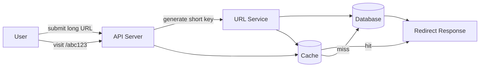
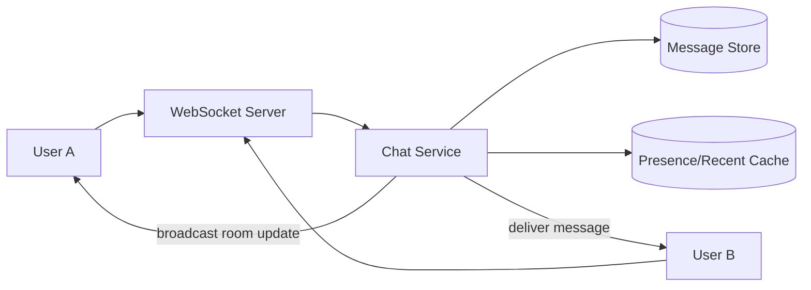
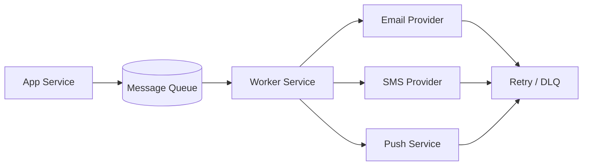
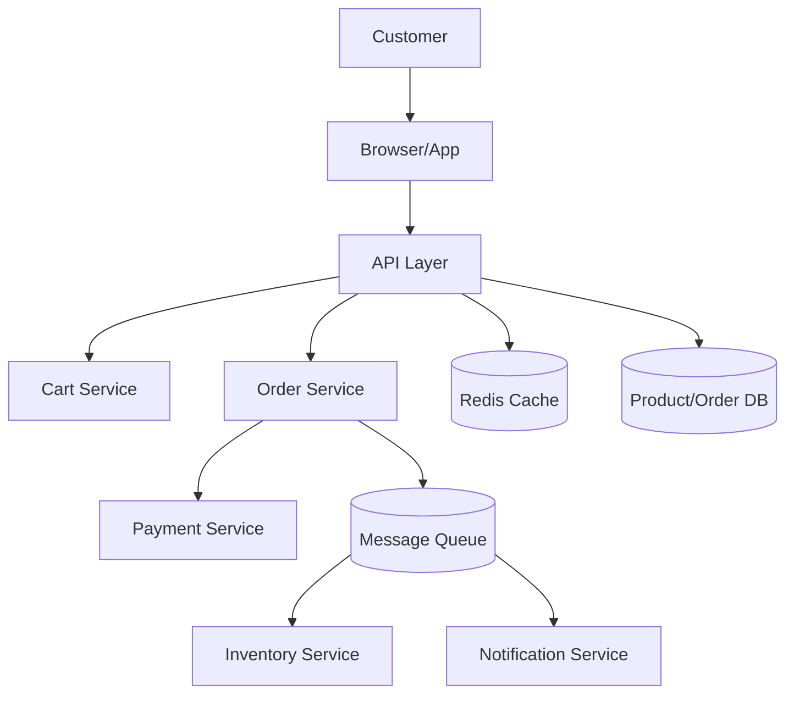
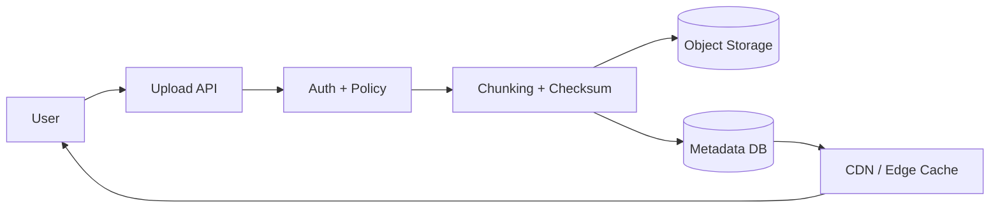
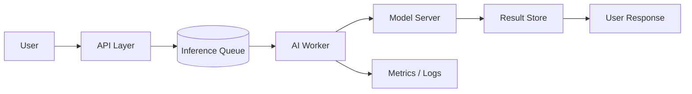

## System design examples

### 1. URL shortener design

Problem:

- given a long URL, generate a short URL
- redirect users to the original URL quickly
- handle high traffic efficiently

Key components:

- API layer for create/redirect requests
- database to store original URL and short code
- cache for hot URLs
- hash generation or base62 encoding
- load balancer in front of app instances

Main flow:

- user submits a long URL
- server generates a unique short key
- store key -> original URL mapping in DB
- cache the mapping for quick access
- redirect request goes to lookup service and returns 301/302 redirect

Important considerations:

- short keys must be unique
- database design should support fast lookup
- cache reduces repeated redirect latency
- rate limiting prevents abuse

Example flow:

### 2. Chat application design

Problem:

- users send and receive messages in real time
- support many concurrent users
- maintain message delivery and read status

Key components:

- web socket servers for real-time communication
- application servers for business logic
- message store for persistent chat history
- cache for active sessions and recent conversations
- notification system for offline users

Main flow:

- client opens websocket connection
- server keeps a connection mapping for each user
- message is sent to the target user or room
- app stores the message in DB
- receiver gets real-time update via websocket

Important considerations:

- connection management is critical at scale
- fan-out for group chats can be expensive
- message ordering may need per-room sequence rules
- presence and online status add complexity

Example flow:

### 3. Notification service design

Problem:

- send email, SMS, and push notifications reliably
- handle large volumes without blocking user actions

Key components:

- API service receives notification requests
- message queue buffers work
- worker services process delivery
- email/SMS/push providers as downstream integrations
- retry and dead-letter infrastructure

Main flow:

- app emits a notification event
- message broker stores the event
- workers read and deliver it
- if provider fails, event is retried
- failures after retries go to a dead-letter queue for investigation

Important considerations:

- asynchronous delivery prevents user request delay
- idempotency avoids duplicate sends
- provider rate limits must be respected
- observability is essential for retries and failures

Example flow:

### 4. E-commerce platform design

Problem:

- allow users to browse products, add to cart, place orders, and pay
- support large concurrent traffic
- maintain data consistency and reliability

Key components:

- web/API tier
- product catalog database
- inventory service
- cart service
- order service
- payment service
- search and recommendation systems
- cache layer
- message queue for async workflows

Main flow:

- user searches or views products
- product data is fetched from cache or DB
- cart updates are stored and validated
- order is created after stock checks
- payment service handles transaction processing
- inventory and notification events are fired asynchronously

Important considerations:

- payments require strong consistency and careful failure handling
- inventory updates should avoid overselling
- caching reduces read load for popular products
- queue-based processing decouples order confirmation and notifications

Example flow:

### 5. File storage service design

Problem:

- accept large file uploads securely
- store files durably and efficiently
- allow fast access for downloads and media delivery
- manage metadata, chunking, versioning, and access control

Key components:

- client upload/download service
- API gateway with auth and policy checks
- metadata service and metadata database
- object storage for file bytes
- chunking and checksum service
- CDN for edge delivery
- logging and monitoring for failures and retries

Main flow:

- client uploads a file to the API
- service validates the request and user permissions
- the file is split into chunks and uploaded to object storage
- metadata database keeps the file record, version, and chunk list
- clients download either from CDN or the object store origin
- the system can invalidate or refresh CDN content on updates

Important considerations:

- large uploads should support retries and resume capability
- metadata is as important as the file bytes themselves
- private files need signed URLs or origin validation
- object storage is ideal for immutable files, while block storage suits database disks
- AI workloads often use this pattern for training data, checkpoints, and document storage

Example flow:

### 6. AI-powered application design

Problem:

- accept user input, run AI inference, and return results quickly
- support many concurrent requests
- handle model failures and retry logic

Key components:

- API gateway or reverse proxy
- app server and validation layer
- job queue for asynchronous inference tasks
- model serving layer or inference workers
- vector database or retrieval system for RAG
- cache for frequent responses
- logs and metrics for latency and accuracy

Main flow:

- user submits request with prompt or document
- app validates and stores metadata
- request goes to queue for inference
- worker loads model and performs inference
- output is stored and returned to the user or next system

Important considerations:

- prompt injection safeguards are essential
- model latency can be much higher than normal API calls
- asynchronous design helps under traffic spikes
- versioning and monitoring protect production reliability

Example flow:

