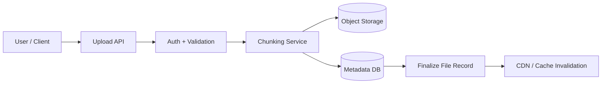
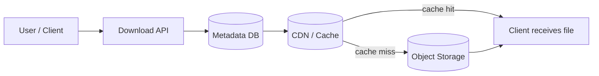
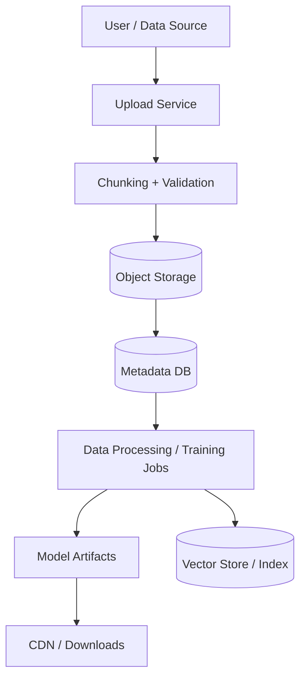
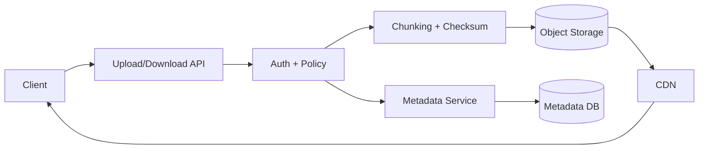

## File storage and object storage

### Why file storage matters

Modern systems store more than just text and rows. They also store:

- user uploaded images and videos
- PDF and document files
- large backups and archives
- logs and analytics artifacts
- AI training datasets and model checkpoints

A good file-storage design must answer these questions:

- how do we upload large files safely?
- how do we manage metadata and access control?
- how do we serve files quickly across regions?
- how do we handle failures, retries, and partial uploads?

---

### Object storage vs block storage

| Storage type   | Best for                                   | How it works                                       | Strengths                                     | Weaknesses                                     |
| -------------- | ------------------------------------------ | -------------------------------------------------- | --------------------------------------------- | ---------------------------------------------- |
| Object storage | Files, backups, media, documents, archives | Files are stored as objects with keys and metadata | Very scalable, cheap, easy to serve over HTTP | Not ideal for low-latency random writes        |
| Block storage  | Databases, VMs, transactional disks        | Data is split into fixed-size blocks               | Fast random I/O, good for databases           | Less convenient for sharing across systems     |
| File storage   | Shared folders and network file systems    | Data is organized in directories and files         | Familiar POSIX-style access                   | Harder to scale to global, web-first use cases |

#### Object storage

Object storage treats each file as a single object with:

- object key or path
- size
- content type
- checksum
- creation time
- custom metadata

Common examples:

- AWS S3
- Azure Blob Storage
- GCS
- MinIO

This is often the best choice for user uploads and public media.

#### Block storage

Block storage is attached to a VM or instance like a disk.

Use it when you need:

- database volumes
- filesystem mount points
- virtual machine disks
- low-latency random access

This is different from object storage because it is not designed for web-scale content delivery or public HTTP access.

---

### Metadata management

Metadata is the information that tells the system what a file is, who owns it, where it lives, and how it should be handled.

Typical metadata fields:

- file ID
- file name
- owner user ID or tenant ID
- content type
- file size
- checksum
- version number
- upload time
- tags or labels
- lifecycle policy
- storage region

Why metadata matters:

- supports lookup and search
- enables authentication and authorization
- allows versioning and retention policy
- helps with audit and billing
- supports deduplication and lifecycle cleanup

A common design is:

- metadata database stores searchable file metadata
- object store stores the actual file bytes
- API layer connects the two

This keeps lookups fast while allowing large files to be stored in a scalable backend.

---

### Chunking files

Large files are usually split into smaller chunks before upload.

Why chunking is useful:

- supports partial uploads and resume logic
- reduces re-upload cost on network retries
- allows parallel upload of chunks
- helps with large file transfer reliability
- works well with distributed storage systems

Typical flow:

- file is split into chunks of 4 MB or 8 MB
- each chunk gets a unique chunk ID
- chunk hashes are computed for validation
- chunks are uploaded independently
- metadata stores the final chunk list and file assembly order

Example:

- a 2 GB video file may be split into 512 chunks
- each chunk is uploaded separately
- a final metadata record points to the complete chunk sequence

This pattern is common in cloud storage, backup systems, and video platforms.

---

### Upload flow

A typical upload flow looks like this:

Step-by-step:

1. Client requests upload.
2. API validates auth, tenant, quotas, and file size.
3. The system splits the file into chunks.
4. Each chunk is uploaded to object storage.
5. The server records checksum, offset, chunk IDs, and metadata in the metadata database.
6. After all chunks are uploaded, the system creates the final file record.
7. The file is ready for download or serving.

Important considerations:

- support retry for failed chunk uploads
- use idempotency keys to avoid duplicate file creation
- verify checksums to prevent corruption
- apply quota limits and abuse protection

---

### Download flow

Downloaded files usually follow a simpler path than uploads.

Typical steps:

1. Client requests a file by ID or path.
2. API looks up metadata and authorization.
3. If file is public or cached, the request may be served by CDN.
4. If not cached, the origin object store serves the file.
5. The file is streamed to the user.

For large files, the system may also support:

- range requests
- resume downloads
- partial file streaming
- signed URLs for temporary access

---

### CDN integration

A CDN sits in front of static or semi-static content and serves it from edge locations closer to users.

Common CDN use cases:

- images and product thumbnails
- PDFs and documents
- media files and videos
- static website content
- downloadable artifacts

Benefits:

- lower latency
- less load on the origin storage system
- better global performance
- reduced bandwidth cost for repeated access

Typical pattern:

- user uploads file to object storage
- metadata is stored in the app database
- CDN edge cache is populated or invalidated
- clients request the file from the CDN URL

Security note:

- for private files, CDN requests should use signed URLs or origin validation
- never expose raw storage URLs without authorization

---

### AI architecture suggestions

File storage is especially important in AI systems because they often deal with large datasets, artifacts, and generated outputs.

#### AI data storage pattern

- Object storage for raw datasets, prompts, documents, videos, and model artifacts
- Metadata database for versioning, tags, ownership, and lineage
- Chunking for very large files and streaming ingestion
- CDN for public model outputs, documents, or downloadable datasets

#### Example AI pipeline

Use cases:

- storing training data, feature sets, and evaluation files
- keeping model checkpoints and weight files
- serving generated documents or prompts to users
- storing user-uploaded dataset files for RAG pipelines

AI-specific design rules:

- keep immutable artifacts versioned
- track dataset lineage and prompt history
- apply access control to sensitive training data
- use signed URLs for private model downloads
- avoid storing secrets inside file metadata

---

### HLD design for a file storage service

A simple high-level design includes these components:

- client app or browser
- API gateway or upload service
- authentication and authorization layer
- metadata service
- object store for file bytes
- chunking and checksum service
- CDN for edge delivery
- observability and monitoring

Main responsibilities:

- upload service validates requests and permissions
- chunker splits large files for reliability
- object store persists bytes durably
- metadata store tracks file state and access information
- CDN serves hot files globally

Example architecture:

### Interview takeaway

When asked about file storage, explain:

- object storage is best for large, immutable files
- block storage is best for attached VM disks and database volumes
- metadata is what makes files searchable and manageable
- chunking improves reliability and large-file handling
- CDN is important for performance and global access
- AI systems need versioned storage, lineage, and secure access models

### Common interview questions

- What is the difference between object storage and block storage?
- How would you design a file upload system for very large files?
- How do you manage metadata and access control for uploaded files?
- How would you integrate a CDN with object storage?
- How do you design file storage for AI datasets and model artifacts?

---

### Summary

A strong file storage system design combines:

- scalable object storage
- structured metadata management
- resilient chunking and checksum validation
- secure access and signed URLs
- CDN integration for fast public delivery
- AI-friendly versioning and dataset lineage

This is the pattern used by cloud storage systems, media platforms, backup services, and large AI data pipelines.
