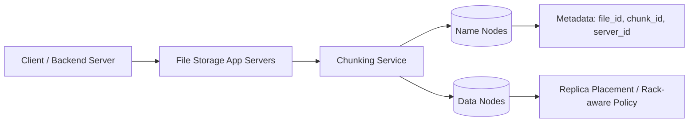
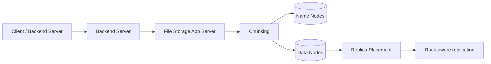
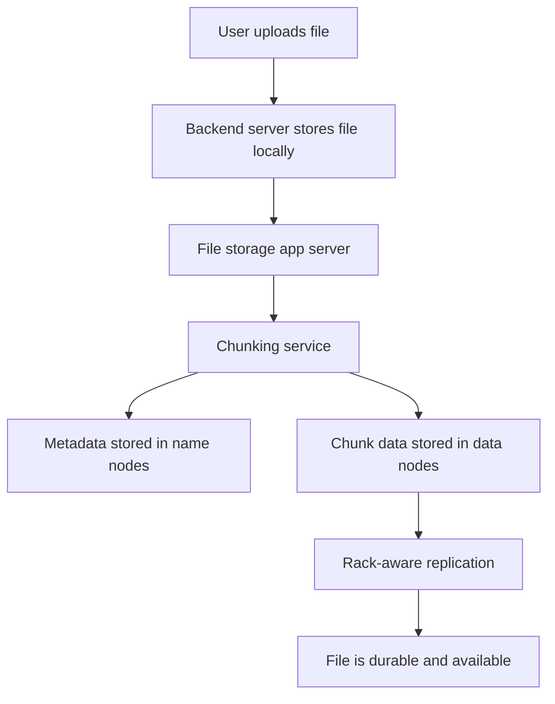
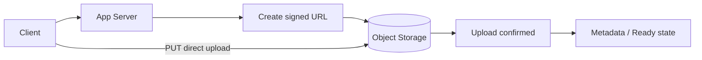
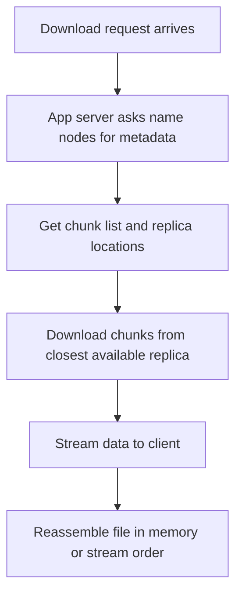
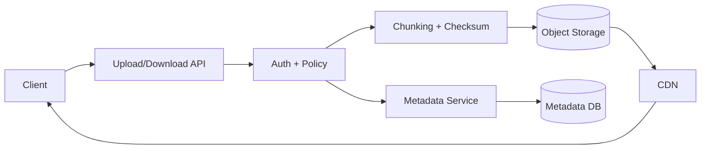

## File storage and object storage

### Why file storage matters

Modern systems store more than just text and rows. They also store:

- user uploaded images and videos
- PDF and document files
- large backups and archives
- logs and analytics artifacts
- AI training datasets and model checkpoints

A good file-storage design must answer these questions:

- how do we upload large files safely?
- how do we manage metadata and access control?
- how do we serve files quickly across regions?
- how do we handle failures, retries, and partial uploads?

---

### Why do we need file storage?

Databases are great for structured data, but they are a poor fit for very large, unstructured files.

Examples of data that should not live directly in a relational database:

- videos and audio files
- large PDFs
- user-uploaded media
- logs generated by millions of servers
- large backups and archives
- AI datasets and model artifacts

A database may store file metadata, but not the actual large binary payload itself.

---

### Object storage vs block storage

| Storage type | Best for | How it works | Strengths | Weaknesses |
| --- | --- | --- | --- | --- |
| Object storage | Files, backups, media, documents, archives | Files are stored as objects with keys and metadata | Very scalable, cheap, easy to serve over HTTP | Not ideal for low-latency random writes |
| Block storage | Databases, VMs, transactional disks | Data is split into fixed-size blocks | Fast random I/O, good for databases | Less convenient for sharing across systems |
| File storage | Shared folders and network file systems | Data is organized in directories and files | Familiar POSIX-style access | Harder to scale to global, web-first use cases |

#### Object storage

Object storage treats each file as a single object with:

- object key or path
- size
- content type
- checksum
- creation time
- custom metadata

Common examples:

- AWS S3
- Azure Blob Storage
- GCS
- MinIO

This is often the best choice for user uploads and public media.

#### Block storage

Block storage is attached to a VM or instance like a disk.

Use it when you need:

- database volumes
- filesystem mount points
- virtual machine disks
- low-latency random access

This is different from object storage because it is not designed for web-scale content delivery or public HTTP access.

---

### Object storage vs block storage vs file storage

| Storage type | Unit | Access pattern | Typical use | Best fit |
| --- | --- | --- | --- | --- |
| Object storage | Key + blob | HTTP API | uploads, media, backups | large immutable files |
| Block storage | Fixed-size block | attach to a host | databases, VM disks | low-latency random I/O |
| File storage | File in folder | network mount | shared documents and NAS | familiar file-based access |

#### Interview rule

> Blob storage is for users and media; block storage is for databases and VM disks; file storage is for shared folders and legacy filesystem patterns.

---

### Why not store very large files directly in a database?

Can we put a very large file directly into a database?

- No, not in a practical production design.
- Databases are optimized for structured records, not giant binary objects.
- A single file can be much larger than normal row limits and storage patterns expect.
- Replication, backups, and recovery become expensive and slow.
- Reads and writes on huge blobs are inefficient compared with dedicated object/file storage systems.

That is why we use dedicated file storage or object storage systems for large files, while the database stores only metadata such as file ID, owner, timestamp, size, and access rights.

---

### Requirement gathering

When a system design is discussed, engineers usually separate requirements into two categories.

#### Functional requirements

These describe the features the system must provide:

- client or user should be able to upload files
- client or user should be able to download files
- system must support very large files, such as tens or hundreds of TB
- system must support appending or updating large files when needed
- system must provide durability and fault tolerance
- system should support basic analytics like word count, keyword search, and log processing

#### Non-functional requirements

These describe quality attributes and design trade-offs:

- low latency for metadata lookups and hot files
- full-text search support for some workloads
- paginated queries by time or file ID
- high availability and distributed fault tolerance
- consistency requirements for recently uploaded or modified files

The CAP trade-off is important here:

- a distributed file system cannot be fully consistent, available, and partition tolerant at the same time
- in most large file systems, we prefer partition tolerance and then choose between consistency and availability
- for many file systems, immediate consistency is preferred after upload or edit because users expect fresh files immediately

### Object storage vs block storage vs file storage

| Storage type | Unit | Access pattern | Typical use | Best fit |
| --- | --- | --- | --- | --- |
| Object storage | Key + blob | HTTP API | uploads, media, backups | large immutable files |
| Block storage | Fixed-size block | attach to a host | databases, VM disks | low-latency random I/O |
| File storage | File in folder | network mount | shared documents and NAS | familiar file-based access |

#### Object storage

Object storage treats each file as a single object with:

- object key or path
- size
- content type
- checksum
- metadata
- creation and modification timestamps

This is usually the right answer for large user uploads, media files, and public downloadable content.

#### Block storage

Block storage is attached to a VM or machine like a disk. It is best for:

- database volumes
- app server disks
- transactional storage
- low-latency random I/O workloads

#### File storage

File storage is organized in directories and mounted as a shared filesystem. It is familiar but less scalable for very large, global workloads compared with object storage.

This is the key interview rule:

> Blob storage is for users and media; block storage is for databases and VM disks; file storage is for shared folders and legacy filesystem patterns.

### Popular file storage systems

#### Managed services

- AWS S3
- Azure Blob Storage
- Google Cloud Storage

These services are designed for:

- scalable object storage
- durable file retention
- HTTP-based download/upload
- low cost per TB
- integration with CDN and analytics tools

#### Open source solutions

- Hadoop Distributed File System (HDFS)
- Git Large File Storage (LFS)

These are useful when teams want:

- self-hosted storage
- distributed storage across nodes
- custom replication and data-placement logic

---

### Why not store very large files directly in a database?

Large files are not a good fit for database storage because:

- database row size increases significantly
- binary files create heavy I/O and storage overhead
- backups and replication become expensive
- random reads and writes on huge files are not efficient
- databases are optimized for structured records, not blob-heavy workloads

So the usual design is:

- database stores metadata and pointers
- object/file storage stores the actual file data

This gives us efficient lookup and scalable storage.

---

### Use cases of large file storage

#### 1. Multimedia consumed by users

- YouTube and Netflix store video/audio files
- Scribd stores PDFs
- social media stores user-generated media

#### 2. User uploads

- social platforms
- video-sharing apps
- Q&A sites like Stack Overflow, Reddit, Quora

#### 3. Centralized log storage

Large systems generate huge amounts of logs.

Example:

- Google runs millions of servers
- all these servers generate logs continuously
- log data is aggregated into a central storage system
- total data can easily exceed 100 TB

This kind of data is usually not served directly to end users.
Instead, a CDN or cache layer serves smaller, popular files while logs remain in storage.

### CDN is actually a cache

CDNs are not the primary storage layer. They are an edge cache in front of the real file storage system.

This means:

- origin storage holds the actual data
- CDN stores hot or frequently accessed files near users
- users usually get files from the CDN, not from the backend storage directly
- this reduces latency and protects the storage backend from heavy read traffic

For very large media files, the main storage remains object storage or distributed file storage, while the CDN handles fast user delivery.

---

### Functional requirements

A file storage system should support:

1. client or user uploads and downloads files
2. support very large files, such as hundreds of TB
3. support appending to existing files when needed
4. durability and fault tolerance
5. basic analytics over files

Examples of analytics:

- count number of words in a file
- search for occurrences of a word
- process logs by time range
- generate metadata summaries and file statistics

---

### Non-functional requirements

1. low latency for metadata lookups and hot files
2. full-text search capability for some workloads
3. paginated queries by time or file ID
4. distributed availability and fault tolerance
5. strong consistency where file reads should reflect recent writes

#### CAP trade-off

In distributed systems, you cannot guarantee all three:

- Consistency
- Availability
- Partition tolerance

The usual rule is:

- choose two out of three
- most large-scale file systems prefer partition tolerance
- then they choose consistency or availability depending on business needs

For this type of system, immediate consistency after upload or edit is usually preferred because users expect the new file to show up as soon as it is uploaded.

---

#### Why consistency matters here

If a user uploads a file and immediately tries to view it, they expect the new content to be visible.

Similar issue:

- a file is edited, but users still see stale data

This creates a bad user experience.

So many file systems prefer strong consistency for metadata and file visibility, which makes the system effectively a CP-style design.

---

### Design options for large files

#### Option 1: store the entire file on one server

Pros:

- easier design
- no need to manage chunk metadata

Cons:

- file size is limited by the server's disk
- not scalable for very large files
- single machine becomes a bottleneck

#### Option 2: split the large file into chunks and store chunks on multiple servers

Pros:

- file size is no longer limited by one machine
- supports horizontal scaling
- better fault tolerance

Cons:

- chunk metadata must be tracked
- assembly is required during download
- more complex than a single-server design

For very large files, the chunked design is the right choice.

---

### Chunking a file

Large files are usually split into smaller chunks before upload.

Why chunking is useful:

- supports partial uploads and resume logic
- reduces re-upload cost on network retries
- allows parallel upload of chunks
- helps with large file transfer reliability
- works well with distributed storage systems

Typical flow:

- file is split into chunks of 4 MB or 8 MB
- each chunk gets a unique chunk ID
- chunk hashes are computed for validation
- chunks are uploaded independently
- metadata stores the final chunk list and file assembly order

Example:

- a 2 GB video file may be split into multiple chunks
- each chunk is uploaded separately
- a final metadata record points to the complete chunk sequence

#### Why chunk size should not be too small or too large

- If chunk size is too large, upload, download, and processing each chunk becomes difficult and slow.
- If chunk size is too small, the number of chunks becomes huge and metadata overhead explodes.
- Example: a 100 TB file with 1 KB chunks would create an enormous number of chunks and huge metadata overhead.

This is the real trade-off behind choosing a balanced chunk size.


If a 100 TB file is stored as one unit, it is a poor fit for distributed storage.

The better approach is:

- split the file into many chunks
- store each chunk on different servers
- keep the chunk list in metadata

Example:

- file0 -> chunk0, chunk1, chunk2, chunk3, ...

Metadata record pattern:

- file_id
- chunk_id
- server_id

This tells the system:

- which file the chunk belongs to
- which chunk it is
- where the chunk is stored

#### Metadata overhead problem

If chunk size is too small, too many chunks are created.

Example:

- 100 TB file
- chunk size = 1 KB
- number of chunks becomes extremely large
- metadata size becomes huge

This creates serious overhead.

If chunk size is too large, upload and download operations become harder to handle.

So the chunk size must be balanced carefully.

#### Practical chunk sizes

Traditional distributed file systems use chunk sizes like:

- HDFS 1.0: 64 MB
- HDFS 2.0: 128 MB

For a 100 TB file:

- 100 TB / 128 MB is roughly 10^6 chunks
- metadata overhead is acceptable compared with full-file storage and processing cost

That is why chunking is practical at large scale.

#### Why chunk size should not be too small or too large

- If the chunk size is too large, the upload, download, and processing of each chunk becomes difficult and slow.
- If the chunk size is too small, the number of chunks becomes very high and metadata overhead grows sharply.
- Example: 100 TB file with 1 KB chunks would create an enormous number of chunks and too much metadata.

This is the real trade-off behind choosing a balanced chunk size like 64 MB or 128 MB.

---


### Metadata management

Metadata is the information that tells the system what a file is, who owns it, where it lives, and how it should be handled.

Typical metadata fields:

- file ID
- file name
- owner user ID or tenant ID
- content type
- file size
- checksum
- version number
- upload time
- tags or labels
- lifecycle policy
- storage region

Why metadata matters:

- supports lookup and search
- enables authentication and authorization
- allows versioning and retention policy
- helps with audit and billing
- supports deduplication and lifecycle cleanup

A common design is:

- metadata database stores searchable file metadata
- object store stores actual file bytes
- API layer connects the two

### Metadata design

A file system must track chunk metadata.

Each chunk metadata record might include:

- file_id
- chunk_id
- server_id
- replication info
- checksum
- timestamp
- version

The metadata is usually stored in dedicated name nodes.

The actual data is stored in data nodes.

---

---

### CDN is actually a cache

CDNs are not the primary storage layer. They are an edge cache in front of the real file storage system.

This means:

- origin storage holds the actual data
- CDN stores hot or frequently accessed files near users
- users usually get files from the CDN, not from the backend storage directly
- this reduces latency and protects the storage backend from heavy read traffic

For very large media files, the main storage remains object storage or distributed file storage, while the CDN handles fast user delivery.

---

### Fault tolerance and replication

To protect against machine failure, each file chunk is replicated across multiple servers.

Example replication factor:

- 3 copies of each chunk

If all copies of a chunk are placed on the same server, failure of that server means losing all copies.

So replication must follow a rack-aware policy.

#### Rack-aware replication policy

##### Server level

- no two copies should be stored on the same server

This ensures one server failure does not wipe out all copies.

##### Rack level

- no two copies should be stored in the same rack

This protects against power failures or rack-level outages.

##### Data-center level

- at least one copy should be in a different data center

This protects against a full regional disaster.

This is the classic distributed storage rule:

- do not keep all replicas on one server
- do not keep all replicas in one rack
- do not keep all replicas in one data center

---

### File storage architecture

A large file storage system has these major components:

- client or backend server
- file storage application servers
- metadata nodes, often called name nodes
- data nodes that store actual file chunks
- replication and rack-aware placement logic

The overall architecture is:

- a client uploads a large file to the backend server
- the backend server forwards the file to the file storage app server
- the app server splits the file into multiple chunks
- the metadata layer stores mappings like file_id -> chunk_id -> server_id
- the data nodes store the actual chunk data
- replicas are placed across multiple servers and racks for fault tolerance

This design is exactly why distributed file systems can handle very large files without depending on one machine.

- client or backend server
- file storage application servers
- name nodes for metadata
- data nodes for actual file chunks
- replication and rack-awareness logic



#### Role of name nodes

Name nodes store the file-to-chunk mapping and the location of each chunk.

Typical metadata includes:

- file id
- chunk id
- chunk location
- replica locations
- metadata versions

They are usually replicated with a master-slave design:

- one master node handles writes and coordination
- other nodes act as replicas or failover nodes
- if the master fails, one replica becomes master

#### Role of data nodes

Data nodes store the actual chunk bytes.

Each chunk is replicated across multiple data nodes using the rack-aware algorithm.

### Lecture-style file storage design

This is the common large-file design flow used in distributed file systems:

1. User uploads a file to the backend server.
2. Backend server stores the file in its local disk temporarily.
3. Backend server uploads that file to the file storage application server.
4. File storage app server splits the file into chunks.
5. Metadata of all chunks is stored in name nodes.
6. Actual chunk data is stored in data nodes.
7. Each chunk is replicated across multiple servers for durability.



This is the simple idea behind systems like HDFS:

- name nodes hold metadata
- data nodes hold real file data
- app servers coordinate the flow
- replicas are spread across machines and racks

---

### Upload flow

A typical large file upload flow looks like this:



#### Presigned URL upload flow

Instead of streaming bytes through your app servers, the client can upload directly to object storage using a short-lived, signed URL.

This flow is common for image uploads, video uploads, and large media files.

1. Client asks the app server for permission to upload a file.
2. Server validates the user, file type, and size.
3. Server creates a signed URL and returns it to the client.
4. Client uploads directly to object storage with a PUT request.
5. Object storage confirms the upload.
6. Server marks the file record as ready and may trigger metadata or processing jobs.



This is a very important optimization because:

- it avoids routing large file bytes through your application servers
- it reduces bandwidth cost and server load
- it scales much better for large media workloads

#### Server-side signed URL example

```javascript
// app server
const key = "u/42/cat.jpg";
const url = s3.presign({
  key,
  bucket: "my-bucket",
  expires: 300,
  method: "PUT"
});
return url;
```

```javascript
// browser or mobile client
fetch(presignedUrl, {
  method: "PUT",
  headers: { "Content-Type": "image/jpeg" },
  body: fileBytes
});
```

#### Detailed upload steps

1. User uploads the file to the backend server.
2. Backend server stores the file on its local disk.
3. Backend server transfers the file to the file storage app server.
4. The app server splits the file into chunks.
5. Metadata of the chunks is stored in the name nodes.
6. Actual chunk data is stored in data nodes.
7. Each chunk is replicated across multiple servers according to rack-aware placement.

In interview language, the sequence is often summarized as:

1. User will upload file to the backend server
2. Backend server stores that file in its local hard disk
3. Backend server uploads that file from its local hard disk drive to file storage app server
4. Now file storage app server does the file chunking
5. Metadata of file chunks are stored in name nodes
6. File chunk data is stored in data nodes

---

### Direct upload vs through-the-server

| Approach | Advantages | Disadvantages | Best for |
| --- | --- | --- | --- |
| Through the app server | easier validation, custom processing, full control | app server becomes a bottleneck, higher bandwidth cost | small files or strict processing flow |
| Direct upload via presigned URL | lower latency, better scalability, less server cost | validation happens after upload, more signing logic | large media files and user uploads |

#### Through the server

- App server proxies every byte.
- Easier to validate, transform, and inspect the stream in real time.
- Full control over the upload lifecycle.
- But servers become a bandwidth bottleneck.
- Doubles network cost and is harder to scale for large files.

#### Direct upload (presigned URL)

- Client uploads straight to object storage.
- Servers stay thin and stateless.
- Scales to huge files without app server overload.
- Lower cost and latency.
- Validation happens after upload, so you must handle post-upload checks.
- You must still generate secure signed URLs and confirm the upload.

This is the classic trade-off in modern file architectures.

---

### Download flow

A file download follows this pattern:



#### Detailed download steps

1. Download request reaches the app server.
2. App server queries name nodes for metadata.
3. Name nodes return:
   - total number of chunks
   - chunk IDs
   - which replicas exist for each chunk
   - storage locations
4. App server downloads chunk data from the closest healthy replica.
5. If one replica is down, it reads from another replica.
6. It streams the chunks to the client.
7. It may reassemble file data in memory or more commonly stream the chunks in order.

This is how large-file systems recover from node failure while serving data.

In interview language, the download flow is often explained as:

1. Download request comes to app servers inside file storage
2. App server contacts the name nodes and asks for metadata information for all chunks of this file
   - exactly how many chunks
   - which chunks exist
   - where each chunk replica is stored
3. App server starts downloading the chunks
   - first try any available replica
   - if one replica is down, read from another replica
4. It stores this data in memory and starts streaming it to the client
5. It can download multiple chunks in parallel to improve throughput

---

### Why this architecture works

This design solves several problems at once:

- large files are no longer limited by one server disk
- reads and writes can happen across many nodes
- metadata is separated from data
- data is replicated for durability and availability
- chunk placement follows rack-aware rules to avoid correlated failure

---

### Chunking and metadata trade-off summary

| Chunk size | Pros | Cons |
| --- | --- | --- |
| Very large chunk | fewer metadata records, simpler management | hard to upload/download, poor fault recovery, large resend cost |
| Very small chunk | fine-grained parallelism, better recovery | huge metadata overhead, too many files/records |
| Balanced chunk size | practical trade-off for distributed file systems | requires tuning based on workload |

A good file system picks a chunk size that balances:

- metadata overhead
- network efficiency
- failure recovery
- processing speed

---

### Example: large file design for interview

If the interviewer asks:

"Suppose I want to upload a 10 TB file. How do you design it?"

A strong answer is:

- split the file into chunks
- store chunk metadata in name nodes
- store actual chunk data in data nodes
- replicate each chunk to multiple nodes
- use rack-aware placement to avoid same-server and same-rack failures
- stream chunks during download and reassemble them in order
- use CDN for serving hot files to users

---

### CDN usage for large files

Large files are often not served directly from the storage backend to the end user.

Instead:

- the file is stored in the file-storage system
- a CDN caches hot content near users
- users request the file from the CDN edge
- the CDN reduces latency and origin traffic

Examples:

- video streaming
- static media delivery
- uploaded documents
- large downloadable files

---

### AI architecture suggestions

File storage is essential in AI systems because AI pipelines often process large data artifacts.

Common AI use cases:

- storing large datasets and training files
- storing model checkpoints and inference outputs
- serving generated documents or media to users
- keeping versioned data for model training and evaluation

Recommended pattern:

- object storage for huge data files
- metadata service for dataset lineage and versioning
- chunking for large uploads and streaming ingestion
- CDN for public downloads or media delivery
- strict access control for private training data

---

### Final summary

Large file storage systems are designed around three main ideas:

1. split big files into chunks
2. store metadata separately from raw data
3. replicate data across independent nodes and racks

This makes the system:

- scalable
- fault tolerant
- consistent for file metadata and reads
- suitable for video, logs, backups, and AI workloads

The architecture is usually:

- app servers for chunking and orchestration
- name nodes for metadata management
- data nodes for actual stored data
- replication and rack awareness for durability
- CDN for user-facing delivery of hot files

This is the core of modern distributed file systems such as HDFS and cloud object stores.

AI-specific design rules:

- keep immutable artifacts versioned
- track dataset lineage and prompt history
- apply access control to sensitive training data
- use signed URLs for private model downloads
- avoid storing secrets inside file metadata

---

### HLD design for a file storage service

A simple high-level design includes these components:

- client app or browser
- API gateway or upload service
- authentication and authorization layer
- metadata service
- object store for file bytes
- chunking and checksum service
- CDN for edge delivery
- observability and monitoring

Main responsibilities:

- upload service validates requests and permissions
- chunker splits large files for reliability
- object store persists bytes durably
- metadata store tracks file state and access information
- CDN serves hot files globally

Example architecture:



### Interview takeaway

When asked about file storage, explain:

- object storage is best for large, immutable files
- block storage is best for attached VM disks and database volumes
- metadata is what makes files searchable and manageable
- chunking improves reliability and large-file handling
- CDN is important for performance and global access
- AI systems need versioned storage, lineage, and secure access models

### Asked in real interviews

File storage shows up as a standalone question and as a storage layer inside bigger system designs like Dropbox, Instagram, and media platforms.

| Interview Question |
| --- |
| Design a file storage / sharing service (Dropbox) |
| Object vs block storage — when each? |
| How do you upload a 5 GB file reliably? |
| How would you serve files globally with low latency? |
| Where do you store user-uploaded images — DB or elsewhere? |
| Explain presigned URLs and why they’re used |
| How does a CDN reduce latency, and how do you invalidate it? |

> Tip: Open any file-storage answer by explaining the three storage layers: compute, metadata, and data placement. That usually signals strong system design instincts.

### Interview-ready answer: design a Dropbox-style file service

#### 1. Clarify requirements

Users should be able to upload, download, list, and share files. Large uploads must resume after network failures. Files must be private by default, durable, and available from multiple regions. Confirm expected file sizes, traffic, sharing behavior, and consistency needs before choosing exact storage and replication settings.

#### 2. High-level design

- API service authenticates the user, checks quota and permissions, and creates an upload session.
- Metadata database stores file ID, owner, name, size, checksum, version, state, and access policy.
- Object storage stores file bytes; large files use multipart chunks.
- Queue-driven workers verify uploads, scan for malware, generate previews, and update metadata.
- CDN serves authorized, frequently requested downloads through short-lived signed URLs.

#### 3. Upload flow

1. Client calls `POST /files/uploads` with the file name, size, and checksum.
2. Service checks authorization and quota, creates an `UPLOADING` record, and returns an upload ID plus signed part URLs.
3. Client uploads chunks directly to object storage and retries failed parts using the same part IDs.
4. Client calls `POST /files/uploads/{uploadId}/complete` with uploaded part checksums.
5. Service verifies the object checksum and size, then marks the file `READY`. A background event can trigger malware scanning and preview generation.

If completion is retried, the upload ID makes the operation idempotent. An incomplete upload expires and its temporary parts are removed by a lifecycle job.

#### 4. Download and sharing flow

1. Client requests a file by ID.
2. Service checks ownership or sharing permission and confirms the file is `READY`.
3. Service returns a short-lived signed download URL, optionally pointing at the CDN.
4. Client downloads from the CDN or object store, using byte-range requests to resume or seek.

Never treat an unguessable object key as authorization. Check permissions before issuing the URL, keep its lifetime short, and revoke access by changing policy and invalidating or expiring cached authorization.

#### 5. Data model and state

| Record | Important fields |
| --- | --- |
| File | `file_id`, `owner_id`, `name`, `size`, `checksum`, `version`, `state`, `created_at` |
| Upload session | `upload_id`, `file_id`, `part_count`, `expires_at`, `state` |
| Share permission | `file_id`, `principal_id`, `permission`, `expires_at` |

Use explicit states such as `UPLOADING`, `VERIFYING`, `READY`, and `FAILED`; readers only receive files in `READY` state. Keep metadata and permissions in a database, and keep the large byte payload in object storage.

#### 6. Scale and failure handling

- Stateless API instances scale horizontally; object storage handles the large byte traffic.
- Partition metadata by owner or file ID, and index common listing queries such as owner plus creation time.
- Retry failed chunks independently and verify checksums before marking the file ready.
- Use object-store durability features and replication across failure domains; restore metadata from backups and reconcile orphaned objects asynchronously.
- Apply quotas, upload-size limits, malware scanning, encryption, audit logs, and rate limits.
- Measure upload completion time, failed-part rate, download latency, storage errors, and orphan cleanup.

#### 7. Main trade-offs to explain

- Direct-to-object-store upload avoids making application servers a bandwidth bottleneck; proxying through the app is simpler when every byte needs synchronous inspection.
- Multipart uploads improve retryability and parallelism but add session and cleanup state.
- Strong consistency for file metadata makes a completed upload visible immediately; asynchronous previews and indexing can be eventually consistent.
- CDN caching improves global download latency and reduces origin load, but private content needs short-lived authorization and careful cache invalidation.

### Common interview questions with direct answers

| Question | Interview-ready answer |
| --- | --- |
| Object vs block storage: when do you use each? | Use object storage for large files addressed by key and metadata, such as media, backups, and uploads. Use block storage for disks that need low-latency random reads and writes, such as database volumes. Use network file storage when applications need shared filesystem semantics. |
| How do you upload a 5 GB file reliably? | Create an upload session, split the file into multipart chunks, upload parts directly with signed URLs, retry only failed parts, and verify checksums before marking the file ready. Expire incomplete sessions and clean up their parts. |
| How do you serve files globally with low latency? | Put a CDN in front of object storage, cache popular immutable content near users, and use range requests for large files. For private files, authorize first and issue short-lived signed URLs. |
| Should uploaded images be stored in a database? | Store the image bytes in object storage. Keep searchable metadata, ownership, permissions, and the object key in the database. |
| What is a presigned URL? | It is a time-limited URL granting a specific operation on a specific object. It lets clients upload or download directly without exposing long-lived storage credentials. The application still authorizes the request before creating it. |
| How do you invalidate CDN content? | Prefer versioned or content-addressed object keys so changed content gets a new URL. For mutable stable URLs, issue a purge when needed and use a bounded TTL; private authorization should not rely on stale public cache entries. |
| What if upload completion is retried or a chunk fails? | Make completion idempotent using the upload ID, retry only missing or failed parts, verify the final checksum, and transition metadata to `READY` only after validation succeeds. |

---

### Summary

A strong file storage system design combines:

- scalable object storage
- structured metadata management
- resilient chunking and checksum validation
- secure access and signed URLs
- CDN integration for fast public delivery
- AI-friendly versioning and dataset lineage

This is the pattern used by cloud storage systems, media platforms, backup services, and large AI data pipelines.
