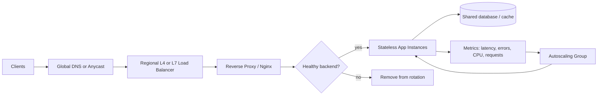

## Load balancing and infrastructure basics

### Load balancing basics

Load balancing is the practice of sending incoming traffic across multiple backend servers so that no single machine becomes a bottleneck.

A good load balancer helps with:

- better utilization of servers
- higher availability during failures
- smoother scaling under traffic spikes
- easier deployment and maintenance

Typical setup:

- users call a domain or public IP
- load balancer receives the request
- it forwards the request to one of the healthy application instances
- the response is returned to the user

In real systems, the load balancer can also handle TLS termination, routing, rate limiting, session stickiness, and health verification.

### Layer 4 vs Layer 7 load balancers

#### Layer 4 (L4) load balancer

L4 load balancers work at the transport/network layer.

They route based on:

- IP address
- TCP/UDP port
- connection metadata

Examples:

- TCP load balancing
- UDP load balancing
- simple packet or connection-level routing

Advantages:

- very fast
- low overhead
- good for general traffic distribution

Disadvantages:

- cannot inspect HTTP path, headers, or cookies
- limited application-aware routing

Use cases:

- game servers
- TCP-based services
- simple service routing where content awareness is not required

#### Layer 7 (L7) load balancer

L7 load balancers work at the application layer.

They can inspect:

- HTTP method
- URL path
- headers
- cookies
- request body (in some cases)

Examples:

- routing /api to one service and /admin to another
- sending mobile traffic to a different backend
- SSL termination and request-based rules

Advantages:

- smarter routing decisions
- better content-based traffic control
- easier security and caching control

Disadvantages:

- more CPU and complexity
- more latency than a raw L4 balancer

Use cases:

- web apps
- APIs
- microservices with path-based routing

### Common load balancing algorithms

#### Runnable round-robin example

The thread-safe Java sample is [RoundRobinLoadBalancerExample.java](RoundRobinLoadBalancerExample.java). Compile and run it with:

```powershell
javac RoundRobinLoadBalancerExample.java
java RoundRobinLoadBalancerExample
```

Dry run with three servers: the index advances once per request and wraps back to the first server after the third.

```text
Request 1 -> server-1
Request 2 -> server-2
Request 3 -> server-3
Request 4 -> server-1
Request 5 -> server-2
Request 6 -> server-3
Request 7 -> server-1
```

#### Round robin

Requests are distributed in a circular order.

Good when:

- all servers have similar capacity
- workloads are evenly distributed

Example:

- server 1 receives request 1
- server 2 receives request 2
- server 3 receives request 3
- then repeat

#### Least connections

The balancer sends the new request to the server with the fewest active connections.

Good when:

- server workloads vary by request intensity
- some backend services are slower than others

This is often better than round robin when traffic is uneven.

#### Weighted load balancing

Some servers get more traffic because they are stronger or have more capacity.

Example:

- server A weight = 3
- server B weight = 1
- server A gets roughly three times the traffic

#### IP hash

The balancer computes a hash from the client's IP and consistently maps the client to the same backend.

Useful for:

- sticky sessions
- caching efficiency
- stateful or session-based services

### Reverse proxy concept

A reverse proxy sits in front of one or more backend servers and represents them to the outside world.

It is different from a forward proxy, which is used by clients to access external networks.

A reverse proxy can:

- hide backend server details
- terminate SSL
- cache static content
- compress responses
- apply rate limiting
- protect against abuse
- route to multiple app servers

In many deployments, the reverse proxy and load balancer are combined in one system such as Nginx or HAProxy.

### Nginx basics

Nginx is a popular reverse proxy and load balancer.

Common responsibilities:

- listen on port 80 or 443
- forward requests to app servers
- serve static files
- handle HTTPS certificates
- load balance between upstream backends

Basic upstream example:

```nginx
upstream app_servers {
    server 10.0.0.11:8080;
    server 10.0.0.12:8080;
    server 10.0.0.13:8080;
}

server {
    listen 80;
    server_name example.com;

    location / {
        proxy_pass http://app_servers;
        proxy_set_header Host $host;
        proxy_set_header X-Real-IP $remote_addr;
    }
}
```

This configuration sends incoming traffic to backend app servers while keeping the application servers behind a single public entry point.

### Health checks

Health checks verify whether a backend instance is able to serve traffic.

A server is marked healthy only if it passes the check.

Common health check methods:

- HTTP GET to /health
- TCP connection check
- custom application-level verification

Examples:

- if /health returns 200, mark as healthy
- if the response is timeout or 500, route traffic away
- if a node fails repeatedly, remove it from the pool

Benefits:

- avoids sending requests to dead instances
- improves availability
- prevents cascading failures

Good health checks should include:

- timeout value
- retry count
- interval
- failure threshold
- graceful recovery behavior

### Auto scaling groups

An Auto Scaling Group (ASG) automatically adds or removes instances based on traffic and health.

Typical goals:

- handle traffic spikes automatically
- reduce cost during idle periods
- maintain enough healthy instances for availability

Key parts of scaling:

- minimum number of instances
- desired number of instances
- maximum number of instances
- scale-out policy when CPU, memory, or request rate rises
- scale-in policy when demand falls

Common triggers:

- CPU utilization > 70%
- application latency > threshold
- request rate > target
- queue length growing beyond a limit

ASGs are usually combined with:

- load balancers
- launch templates or machine images
- health checks
- alarms and metrics

This makes the system easier to scale without manual intervention.

### AI-assisted infrastructure planning

AI can help in early-stage architecture design by:

- generating possible system layouts
- suggesting scaling strategies
- identifying bottlenecks from traffic estimates
- comparing tradeoffs between SQL and NoSQL, caching, queues, and replication
- reviewing infrastructure-as-code templates
- assisting with incident response and troubleshooting steps

Example prompt:

- "Design a scalable e-commerce architecture for 1M daily users with 200ms p95 latency targets."

AI is strongest when used for:

- brainstorming architecture options
- summarizing tradeoffs
- producing initial drafts and checklists
- clarifying operational risk areas

AI is not a replacement for:

- capacity planning
- security review
- failure-mode analysis
- production operations judgment

The best approach is to use AI as a planning assistant, while engineers validate the architecture against real requirements, costs, and reliability constraints.

### Interview perspective

For interviews, explain these concepts clearly:

- L4 balancers are simpler and faster, but less aware of application logic.
- L7 balancers are smarter and more flexible, but heavier.
- Round robin is simple when servers are similar.
- Least connections works better when workloads differ.
- Reverse proxies protect and centralize traffic handling.
- Health checks are necessary for safe and automatic failover.
- Auto scaling is key for handling variable user load.
- AI helps draft architecture, but engineering judgment still decides the final design.

### Asked in real interviews

Load balancing appears in system-design rounds from warm-up questions to production architecture discussions.

| Interview question |
| --- |
| Design a load balancer for a global service. |
| Compare Layer 4 and Layer 7 load balancing. |
| How do you remove a failing server from rotation? |
| How would you autoscale under a traffic spike? |
| Round robin vs least connections: when would you use each? |
| Are sticky sessions a good idea? Why or why not? |
| What is a reverse proxy, and why use Nginx? |

### Interview design: scalable load-balanced service

Start with the requirements: HTTP or TCP traffic, expected throughput, latency target, regions, availability, TLS termination, session behavior, and whether routing must inspect application content. Then describe the request path and failure behavior.



Recommended request path:

1. Global DNS or Anycast directs users to a healthy, nearby region.
2. A regional load balancer accepts connections and distributes them across healthy proxy or application instances.
3. An L7 reverse proxy terminates TLS and routes HTTP requests by host, path, or header where needed.
4. Stateless application instances use shared databases, caches, and session storage so requests can move between instances.
5. Health checks remove unhealthy instances; metrics drive autoscaling, while connection draining lets in-flight requests finish during scale-in or deployment.

For a TCP service with no need for HTTP-aware routing, use L4 to reduce processing overhead. For web APIs that need path routing, TLS termination, or request policy, use L7. Many deployments combine both at different layers.

### Interview answers and design notes

#### 1. What does a load balancer do?

A load balancer is the stable entry point that selects a backend for each connection or request. It improves capacity use and availability, but it does not make a stateful or unhealthy application automatically reliable. The backend pool, health policy, timeouts, retries, and shared state must also be designed.

#### 2. Layer 4 vs Layer 7: how do you choose?

L4 routes using network and transport information such as IP addresses, ports, and TCP/UDP connections. It is efficient and fits non-HTTP protocols or simple pass-through traffic. L7 understands application protocols such as HTTP and can route by host, URL path, headers, or cookies, but inspecting requests adds work and configuration complexity.

Choose the simplest layer that meets the routing and policy requirements. For example, use L4 for a TCP database proxy or game protocol; use L7 for `/api` versus `/images` routing, HTTP redirects, or cookie-aware behavior. TLS can terminate at either layer depending on the product and security design.

#### 3. Which routing algorithm should you use?

| Algorithm | Choose it when | Main limitation |
| --- | --- | --- |
| Round robin | Instances have similar capacity and request cost | Does not account for active work or server differences |
| Weighted round robin | Instances have known, stable capacity differences | Static weights can lag changing load |
| Least connections | Request durations vary and active connection count is meaningful | Connections are only an approximate measure of work |
| Least response time | Latency is a useful signal and measurements are reliable | Can overreact to noisy or short-lived samples |
| IP hash | A temporary compatibility need requires source-IP affinity | Uneven distribution, NAT concentration, and poor failover behavior |

Round robin is a good baseline. Use least connections when long-lived or uneven-duration connections make simple rotation unbalanced. For CPU-heavy or highly variable requests, use measured load or queue depth where the balancer can obtain a trustworthy signal.

The runnable [round-robin example](RoundRobinLoadBalancerExample.java) prints its routing sequence. The [least-connections example](LeastConnectionsLoadBalancerExample.java) demonstrates selecting the backend with the fewest in-flight requests and releasing the connection when work completes.

Compile and run the least-connections example from this folder:

```powershell
javac LeastConnectionsLoadBalancerExample.java
java LeastConnectionsLoadBalancerExample
```

Example dry run:

```text
Request 1 -> server-1
Request 2 -> server-2
Request 3 -> server-3
Request 4 after server-1 completes -> server-1
```

Each `Lease` represents one in-flight request. Call `close()` when that request completes so its active count is decremented; `close()` is idempotent. This is an educational in-process simulation, not a production distributed load balancer: a real balancer must also track health, weights, connection failures, and state consistently across its instances.

#### 4. What is a reverse proxy, and why use Nginx?

A reverse proxy receives requests on behalf of backend services. Nginx can terminate TLS, serve static content, set forwarding headers, route requests to an upstream pool, and apply connection or request limits. It keeps backend addresses private and centralizes common edge behavior. It is not automatically a global load balancer or an application health system; those capabilities depend on the deployment and edition.

Example upstream configuration:

```nginx
upstream app_servers {
    least_conn;
    server 10.0.0.11:8080 max_fails=3 fail_timeout=10s;
    server 10.0.0.12:8080 max_fails=3 fail_timeout=10s;
    keepalive 64;
}

server {
    listen 443 ssl;
    server_name example.com;

    location /api/ {
        proxy_pass http://app_servers;
        proxy_http_version 1.1;
        proxy_set_header Host $host;
        proxy_set_header X-Real-IP $remote_addr;
        proxy_set_header X-Forwarded-For $proxy_add_x_forwarded_for;
        proxy_set_header X-Forwarded-Proto $scheme;
    }
}
```

In open-source Nginx, `max_fails` and `fail_timeout` provide passive failure handling based on observed upstream errors. Active periodic health checks are an Nginx Plus feature or can be provided by an orchestrator or external load balancer. Configure trusted proxy boundaries carefully so clients cannot spoof forwarded IP headers.

#### 5. How should health checks remove and restore a server?

Use a lightweight liveness check to determine whether the process can respond, and a readiness check to determine whether it should receive production traffic. A readiness check can verify essential dependencies, but should not fail merely because an optional dependency is unavailable.

Set a timeout, interval, and failure threshold to avoid reacting to one transient delay. After repeated failures, stop assigning new requests and alert. When checks pass consistently again, reintroduce the instance gradually. During deployment or scale-in, stop new assignments first and drain existing connections. Keep retries bounded and avoid retrying non-idempotent operations without an idempotency strategy.

#### 6. How do autoscaling groups respond to a traffic spike?

An autoscaling group maintains minimum, desired, and maximum instance counts. Scale-out can use request count per instance, queue depth, CPU, or latency; scale-in should use sustained low demand and a stabilization window to avoid oscillation. Capacity takes time to boot, so combine predictive or scheduled capacity for known peaks with reactive policies and a queue or rate limit to absorb sudden bursts. Ensure new instances pass readiness checks before receiving traffic.

#### 7. Are sticky sessions a good idea?

Sticky sessions keep a client mapped to the same backend, often using a cookie or source-IP hash. They can help legacy applications that store session state only in process memory, but create uneven load, reduce failover flexibility, and make deployments harder. Prefer stateless application instances with sessions in a shared store. Use stickiness only when required, keep session state recoverable, and define what happens when the selected instance fails.

For source-IP affinity in open-source Nginx, an upstream can use `ip_hash` instead of `least_conn`:

```nginx
upstream app_servers {
    ip_hash;
    server 10.0.0.11:8080;
    server 10.0.0.12:8080;
}
```

This is an alternative policy, not an additional directive to combine with the earlier `least_conn` example. Many clients behind one NAT address may concentrate on one backend, and a backend change can remap clients, so IP affinity is not a substitute for shared session storage.

#### 8. How do you prevent a load balancer from becoming a single point of failure?

Run redundant balancer instances across availability zones or use a managed highly available service. Provide a stable entry point through Anycast, DNS failover, or a virtual IP, and verify the failover path rather than assuming it works. Keep configuration consistent, monitor control-plane and data-plane health separately, and test zone and regional failure scenarios.

### Short interview response

I would first clarify protocol, traffic, latency, availability, and routing needs. I would put a highly available regional load balancer in front of stateless instances, use L4 for efficient connection routing or L7 when HTTP-aware rules are needed, and choose round robin for similar instances or least connections for uneven request durations. Readiness checks, bounded timeouts, connection draining, and autoscaling protect the backend during failures and demand changes. I would avoid sticky sessions by storing session state externally unless a legacy constraint requires affinity.
