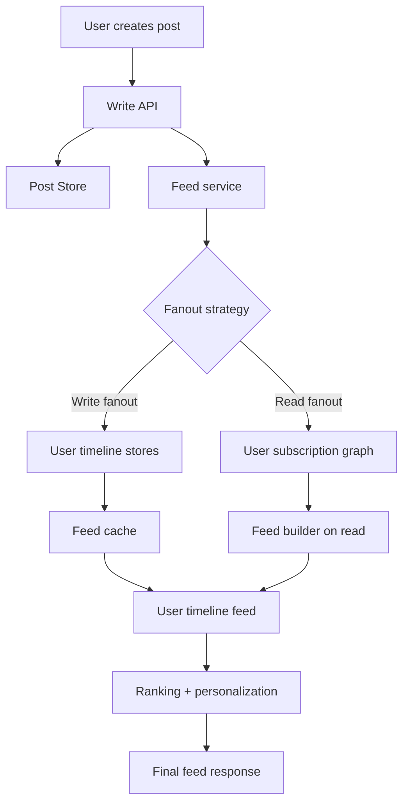
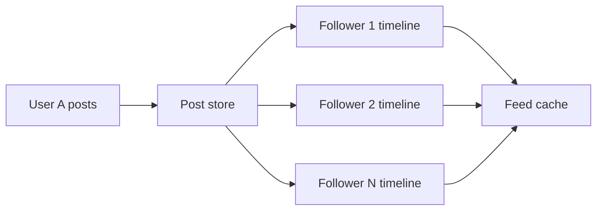
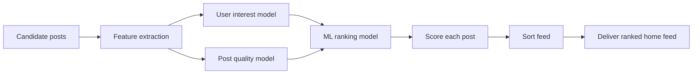

# Feed Generation

Feed generation is the problem of producing a personalized, ranked stream of posts, updates, or content items for a user.

This is common in:

- social media feeds
- short-video platforms
- news feeds
- recommendation feeds
- activity streams
- follower-based content apps

The main challenge is not just storing content. It is building a system that can:

- quickly fetch a user’s feed
- rank the best content first
- handle millions of writes and reads
- stay cheap enough to scale
- remain personalized and fresh

---

## 1. Problem definition

At a high level, a feed system answers:

- Which posts should user U see?
- In what order should they appear?
- How fast can the system return them?
- How do we handle new posts, hot content, and cold content?

Typical requirements:

- low latency for feed fetch
- freshness for new content
- personalized ranking
- support for millions of users and posts
- high write throughput
- efficient caching
- fairness and spam control

---

## 2. Feed architecture overview

A social feed usually has three major layers:

1. User actions and post creation
2. Feed generation and ranking
3. Feed read and cache layer



---

## 3. Core design decisions

There are two main ways to generate feeds:

| Strategy | How it works | Best for | Main trade-off |
| --- | --- | --- | --- |
| Fanout on write | When a user posts, push the post to all relevant followers’ timelines immediately | High-read, large active user bases, viral content | Higher write amplification and storage cost |
| Fanout on read | Store the post once, then fetch and merge relevant posts when a user opens the feed | Less active users, lower write load | Higher read latency and more complex query logic |

---

## 4. Fanout on write

### Idea

When user A posts something, the system creates feed entries for all followers or subscribers of A.

### Example

If A has 10,000 followers:

- one post creates 10,000 feed records
- each record is stored in a user timeline
- when user B opens the feed, the system reads a prebuilt timeline

### Pros

- very fast read path
- feed is already assembled
- ideal for social media timelines
- easy to cache hot feeds

### Cons

- expensive writes
- heavy storage overhead
- viral users can create huge fanout spikes
- difficult to handle user blocks, muted accounts, and personalized ranking

### Best use cases

- Instagram-like feeds
- Twitter/X-like timelines
- heavily read user timelines
- active content creators with many followers

### Design pattern



---

## 5. Fanout on read

### Idea

Store the post once, then when a user asks for the feed, fetch the users they follow and merge their recent posts.

### Example

User B follows 200 creators. When B opens feed:

- fetch the subscriptions list
- fetch recent posts from those creators
- merge, sort, and rank them
- return a personalized timeline

### Pros

- lower write amplification
- simpler write path
- better for users who follow few people
- less storage cost if feed is not precomputed

### Cons

- slower read path
- more complex query logic
- harder to scale for huge active audiences
- ranking and merge cost rises with number of followed users

### Best use cases

- niche or low-activity feeds
- recommendation systems
- accounts with a smaller social graph
- lazy feed generation

---

## 6. Hybrid approach

Most real systems use a hybrid model.

Examples:

- use fanout on write for top friend/follower feeds
- use fanout on read for cold or inactive users
- use cached home feeds for hot accounts
- lazy load older feed items

This is often called a hybrid timeline architecture.

---

## 7. Timeline storage

Timeline storage is where user-specific feed items are kept.

There are usually two common structures:

### A. User timeline

A per-user list of posts that should appear in their home feed.

Example:

- user_id: 42
- timeline: [post_88, post_72, post_41, ...]

This is the most common approach for fanout on write.

### B. Global post store

One source of truth for all posts.

Example:

- post_id
- author_id
- text/media
- created_at
- metadata

Then the feed service builds the feed from this store when needed.

### C. Mixed model

Real systems often use both:

- global storage for post data
- per-user timeline for recency and fast reads
- secondary derived tables for ranking and caching

---

## 8. Feed data model

A typical feed item record contains:

| Field | Purpose |
| --- | --- |
| feed_id | unique feed entry ID |
| user_id | user whose feed this item belongs to |
| post_id | original post ID |
| author_id | who created the post |
| created_at | time of post creation |
| score | ranking score |
| seen_at | last seen timestamp |
| flags | hidden, muted, blocked, spam, etc. |

This data is usually stored in a sorted log or key-value style structure such as:

- user_id + sorted timestamps
- post_id + metadata
- ranking score index for hot items

---

## 9. Ranking algorithms

Ranking decides the order of posts within a feed. The goal is to maximize relevance, engagement, and freshness without creating a boring or spammy feed.

### A. Recency-based ranking

Posts are ordered by time.

Score = time_weight * recency

Pros:

- simple
- fast
- good for breaking news and fresh updates

Cons:

- ignores user preference
- can favor spammy or repetitive content

### B. Engagement-based ranking

Score depends on likes, comments, clicks, watch time, shares, and dwell time.

Score = w1 * likes + w2 * comments + w3 * shares + w4 * watch_time

Pros:

- good for detecting trending and highly useful content
- often better for retention

Cons:

- can amplify low-quality engagement bait
- may overvalue clickbait content

### C. Personalized ranking

Use user-specific signals:

- past interactions
- followed creators
- topics of interest
- click behavior
- time-of-day patterns

Example:

Score = base_quality + user_interest + engagement + recency - penalty

Pros:

- far more relevant than one-size-fits-all ranking
- improves user satisfaction and retention

Cons:

- more complex to compute
- requires stronger feature pipelines and offline training

### D. Multi-objective ranking

Real feeds rarely use a single metric. In practice, the ranking system combines:

- freshness
- relevance
- quality
- novelty
- diversity
- fairness

A typical formula could look like:

$$
score = 0.35 \times relevance + 0.25 \times freshness + 0.20 \times engagement + 0.10 \times diversity + 0.10 \times creator_trust
$$

This gives a balance between user interest and platform quality.

---

## 10. Feed caching

Caching is critical because feed fetches are read heavy and repeated often.

### Common cache layers

- user home feed cache
- top-N cached feed slices
- ranked post cache
- recently seen feed entries
- hot creators’ post cache

### Why caching matters

Without caching:

- every open feed query may scan a large user graph
- ranking logic may recompute many scores
- page load latency grows sharply

### Typical caching strategy

- cache the first page of a user’s feed
- cache top trending posts separately
- invalidate when a user follows someone new, blocks a user, or creates a post
- refresh based on TTL or event-driven invalidation

### Example

```text
cache_key = user_id + feed_version
feed_version increases when:
- user follows/unfollows
- user blocks/mutes someone
- new posts are added to the timeline
- ranking weights change
```

This helps avoid stale data while keeping reads cheap.

---

## 11. Feed freshness and timeline invalidation

Freshness is a major challenge.

If a new post is published, the system should appear quickly in followers’ feeds. But a full recompute of many users’ timelines can be too expensive.

Common strategies:

- push to the top of hot feed caches
- add a delta feed for new posts
- refresh only the first page for active users
- use asynchronous background ranking jobs

---

## 12. AI ranking logic

Modern feed systems often use AI or ML to score feed items.

### What AI helps with

- predicting which posts a user will click
- ranking content by predicted engagement
- reducing spam and low-quality content
- personalizing content for different user segments
- increasing dwell time and retention

### Typical features used by AI ranking

- user interests
- past interactions
- post category or topic
- creator trust score
- content quality signals
- freshness
- click-through probability
- watch time prediction

### Example ranking pipeline



### AI ranking trade-offs

Pros:

- better personalization
- captures subtle user interest patterns
- better long-term engagement

Cons:

- more complex engineering
- model drift over time
- harder to debug than rule-based ranking
- requires strong offline evaluation and online A/B testing

---

## 13. Real-world feed system pattern

A strong production design often looks like this:

1. Write post to post store
2. Update author’s own timeline
3. Determine followers/subscribers
4. Fanout to relevant user timelines or build feed lazily
5. Cache hot home feeds
6. Rank posts using recency + personalization + engagement
7. Return the top N items to the client
8. Store ranking feedback for future predictions

---

## 14. Common interview questions

### Asked in real interviews

| Question | What they want to hear |
| --- | --- |
| Design a social feed system | Architecture, read/write trade-offs, scaling |
| Fanout on write vs fanout on read | pros/cons, when to choose each |
| How do you make the feed fast? | caching, indexing, timeline design |
| How do you rank feed items? | recency, relevance, engagement, AI model |
| How do you scale for viral users? | partitioning, async fanout, queueing |
| How do you handle stale feed data? | invalidation, TTL, feed versioning |
| How do you personalize the feed? | user embeddings, features, A/B tests |

---

## 15. Trade-off summary

| Topic | Fanout on write | Fanout on read |
| --- | --- | --- |
| Read latency | Very low | Higher |
| Write cost | High | Lower |
| Storage cost | Higher | Lower |
| Good for viral users | Yes | Harder |
| Feed personalization | Good with extra logic | Naturally flexible |
| Complexity | Complex write path | Complex read path |

---

## 16. Recommended approach for most systems

If you are asked to design a feed in an interview, the best answer is usually:

- store posts in a durable post store
- maintain per-user timeline or inbox for hot/frequent users
- use hybrid fanout for active users
- lazy fetch or merge older content for less active users
- cache the home feed for the first page
- rank using a mix of recency, engagement, and personalization
- add AI ranking only after the core pipeline is stable

---

## 17. Short interview answer

A feed system should separate post storage, feed generation, and read caching. The key trade-off is between fanout on write and fanout on read. Fanout on write is faster for reading and better for active social graphs, but it creates heavy write amplification. Fanout on read is cheaper for writes and flexible, but slower when reading and harder to scale. Most real systems use a hybrid approach with cached timelines, personalized ranking, and ML-based scoring for the final ordering.

---

## 18. Final takeaway

The feed generation problem is a classic balance between:

- read performance
- write cost
- freshness
- personalization
- scalability
- ranking quality

The best feed systems are not just storage systems. They are ranking engines plus caching layers plus personalized timelines.
