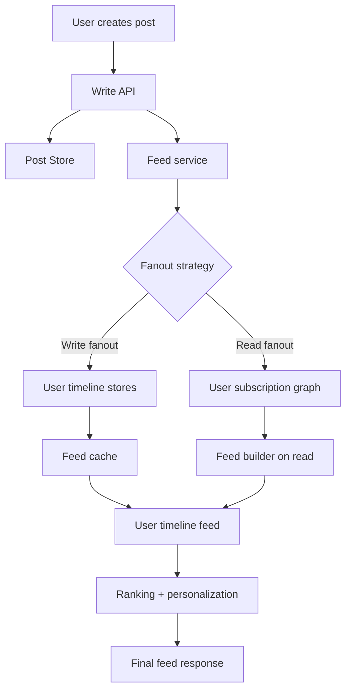
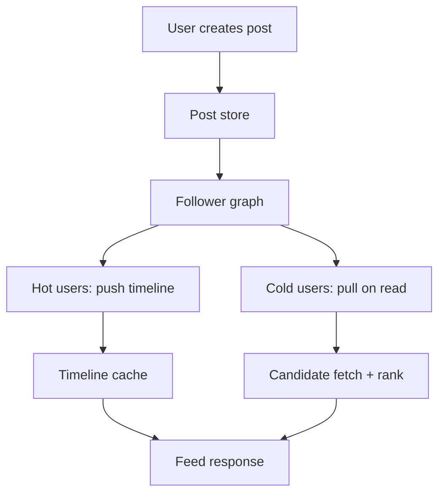
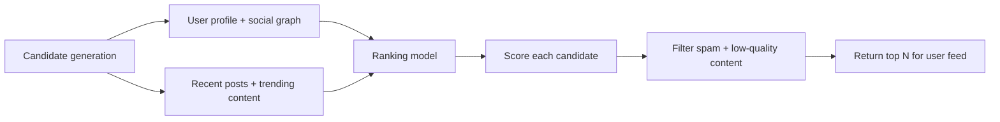
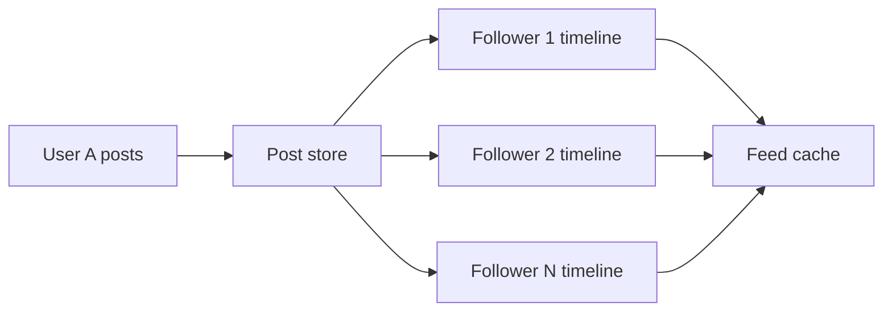
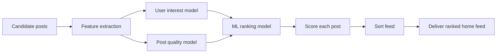

# Feed Generation

Feed generation is the problem of producing a personalized, ranked stream of posts, updates, or content items for a user.

This is common in:

- social media feeds
- short-video platforms
- news feeds
- recommendation feeds
- activity streams
- follower-based content apps

The main challenge is not just storing content. It is building a system that can:

- quickly fetch a user’s feed
- rank the best content first
- handle millions of writes and reads
- stay cheap enough to scale
- remain personalized and fresh

---

## 1. Problem definition

At a high level, a feed system answers:

- Which posts should user U see?
- In what order should they appear?
- How fast can the system return them?
- How do we handle new posts, hot content, and cold content?

Typical requirements:

- low latency for feed fetch
- freshness for new content
- personalized ranking
- support for millions of users and posts
- high write throughput
- efficient caching
- fairness and spam control

---

## 2. Feed architecture overview

A social feed usually has three major layers:

1. User actions and post creation
2. Feed generation and ranking
3. Feed read and cache layer



---

## 3. Designing Social Feeds

A social feed is a personalized, continuously changing stream of content for a user. We are not simply returning the latest posts in time order. We are selecting a candidate set, ordering it using relevance signals, and then serving it within a strict latency budget.

### Feed definition and challenges

A feed is usually shaped by these questions:

- Who are the users and creators?
- Which content and signals matter?
- How many followers can a creator have?
- How frequently do users refresh the feed?
- How fresh should the feed be?
- What is the cost of caching versus recomputing?

Main challenges:

- enormous read/write asymmetry
- hot users and viral content spikes
- personalization quality vs latency
- stale feeds and invalidation complexity
- keeping the feed fresh without doing too much work

### Naive feed query

The simplest possible design is:

- fetch all posts by people the user follows
- merge and sort by timestamp
- return the first N results

Pseudo-code:

```sql
SELECT p.*
FROM posts p
JOIN follows f ON f.following_id = p.user_id
WHERE f.follower_id = :user_id
ORDER BY p.created_at DESC
LIMIT 20;
```

This works only for small datasets. In production, it fails because:

- a user may follow thousands of accounts
- a single viral account may generate too many posts
- ranking by time ignores relevance and engagement
- database scans become expensive at scale

### Fan-out on write (push)

Fan-out on write means that when user A creates a post, the system pushes a copy of that post into A's followers' personalized feed lists.

Pros:

- very fast reads
- good for hot timelines and steady user activity
- easy to cache the first page of a feed

Cons:

- write amplification
- more storage and event-processing cost
- hot creators create huge fanout spikes

### Fan-out on read (pull)

Fan-out on read stores the original post once and, when the user opens the feed, pulls relevant posts from the creators they follow and merges them at read time.

Pros:

- lower write cost
- easier for sparse or inactive users
- simple to store raw content only once

Cons:

- slower reads
- more complex ranking and fetch logic
- harder to scale under large active user graphs

### Push vs pull trade-offs

| Option           | Best for                   | Why it works           | Main pain                 |
| ---------------- | -------------------------- | ---------------------- | ------------------------- |
| Fan-out on write | large active social graphs | feed is already ready  | large write amplification |
| Fan-out on read  | sparse or cold feeds       | only fetch when needed | higher read latency       |

A common rule:

- push for active, heavy-read users and popular creators
- pull for inactive users or low-frequency home feeds
- hybrid for the rest

### Celebrity problem

The celebrity problem happens when a very popular creator has millions of followers. If we push a post to every follower's timeline, we create a large write storm and a huge storage burden.

A practical fix is:

- keep the post in the global post store
- create special hot-content or trending candidate sets
- rank the content at read time for each user
- use a cache for the top page of the feed

This reduces duplication and keeps the system responsive.

### Hybrid solution

Most real social platforms use a hybrid design.

Example:

- store posts in a global store
- maintain a precomputed timeline for active users
- keep a lazy path for inactive or cold users
- use cache warming for hot leaders and top creators
- use ranking and freshness logic before returning the top N items



### Ranking strategies

The feed is not just a list; it is a ranking problem.

Common strategies:

- recency-first: newest posts first
- engagement-based: likes, comments, shares, dwell time
- relevance-based: user interest, author affinity, topic match
- diversity-aware: avoid showing only one creator or topic
- freshness-weighted: blend recent content with user interest

### Scoring and ML ranking

A simple formula can be:

$$
score = w_1 \times recency + w_2 \times affinity + w_3 \times engagement + w_4 \times quality - penalty
$$

Where:

- recency rewards new content
- affinity rewards creators the user interacts with
- engagement captures likes, comments, shares, dwell time
- quality suppresses spam and clickbait
- penalty reduces repetition or low-trust sources

Production systems usually move from handcrafted scoring to ML ranking. The model predicts the probability of a click, dwell time, or conversion and then ranks candidates by predicted relevance.

### Timeline storage and caching

The precomputed timeline is usually stored as:

- one list per user, ordered by score or timestamp
- Redis or in-memory cache for hot user timelines
- a durable post store or database for the master data
- optional derived ranked lists for top feed items

Common storage pattern:

- store post metadata and content separately
- store feed IDs in per-user lists
- keep post content in a separate content store when necessary
- cache the first page and top N sorted candidates

Example:

```text
user:42 -> [post_901, post_756, post_440, ...]
post_901 -> metadata + content ref
```

### AI/ML two-stage pipeline

Many modern feeds use a two-stage pipeline:

1. Candidate generation
   - collect a few hundred likely posts from followed users, trends, and recommendations
2. Ranking and filtering
   - score each candidate using a model and reorder the feed



This setup is common because:

- computing a full global ranking for every user would be too expensive
- candidate generation narrows the search space
- ranking can use personalized, ML-based signals

### Practical production pattern

The best feed design usually combines:

- durable post store
- user graph / follow edges
- push for hot users and top creators
- pull for cold or less active users
- cache for home timeline and first page
- scoring + ML ranking for final ordering
- invalidation and TTL for freshness

---

## 3. Core design decisions

There are two main ways to generate feeds:

| Strategy        | How it works                                                                        | Best for                                          | Main trade-off                                   |
| --------------- | ----------------------------------------------------------------------------------- | ------------------------------------------------- | ------------------------------------------------ |
| Fanout on write | When a user posts, push the post to all relevant followers’ timelines immediately   | High-read, large active user bases, viral content | Higher write amplification and storage cost      |
| Fanout on read  | Store the post once, then fetch and merge relevant posts when a user opens the feed | Less active users, lower write load               | Higher read latency and more complex query logic |

---

## 4. Fanout on write

### Idea

When user A posts something, the system creates feed entries for all followers or subscribers of A.

### Example

If A has 10,000 followers:

- one post creates 10,000 feed records
- each record is stored in a user timeline
- when user B opens the feed, the system reads a prebuilt timeline

### Pros

- very fast read path
- feed is already assembled
- ideal for social media timelines
- easy to cache hot feeds

### Cons

- expensive writes
- heavy storage overhead
- viral users can create huge fanout spikes
- difficult to handle user blocks, muted accounts, and personalized ranking

### Best use cases

- Instagram-like feeds
- Twitter/X-like timelines
- heavily read user timelines
- active content creators with many followers

### Design pattern



---

## 5. Fanout on read

### Idea

Store the post once, then when a user asks for the feed, fetch the users they follow and merge their recent posts.

### Example

User B follows 200 creators. When B opens feed:

- fetch the subscriptions list
- fetch recent posts from those creators
- merge, sort, and rank them
- return a personalized timeline

### Pros

- lower write amplification
- simpler write path
- better for users who follow few people
- less storage cost if feed is not precomputed

### Cons

- slower read path
- more complex query logic
- harder to scale for huge active audiences
- ranking and merge cost rises with number of followed users

### Best use cases

- niche or low-activity feeds
- recommendation systems
- accounts with a smaller social graph
- lazy feed generation

---

## 6. Hybrid approach

Most real systems use a hybrid model.

Examples:

- use fanout on write for top friend/follower feeds
- use fanout on read for cold or inactive users
- use cached home feeds for hot accounts
- lazy load older feed items

This is often called a hybrid timeline architecture.

---

## 7. Timeline storage

Timeline storage is where user-specific feed items are kept.

There are usually two common structures:

### A. User timeline

A per-user list of posts that should appear in their home feed.

Example:

- user_id: 42
- timeline: [post_88, post_72, post_41, ...]

This is the most common approach for fanout on write.

### B. Global post store

One source of truth for all posts.

Example:

- post_id
- author_id
- text/media
- created_at
- metadata

Then the feed service builds the feed from this store when needed.

### C. Mixed model

Real systems often use both:

- global storage for post data
- per-user timeline for recency and fast reads
- secondary derived tables for ranking and caching

---

## 8. Feed data model

A typical feed item record contains:

| Field      | Purpose                              |
| ---------- | ------------------------------------ |
| feed_id    | unique feed entry ID                 |
| user_id    | user whose feed this item belongs to |
| post_id    | original post ID                     |
| author_id  | who created the post                 |
| created_at | time of post creation                |
| score      | ranking score                        |
| seen_at    | last seen timestamp                  |
| flags      | hidden, muted, blocked, spam, etc.   |

This data is usually stored in a sorted log or key-value style structure such as:

- user_id + sorted timestamps
- post_id + metadata
- ranking score index for hot items

---

## 9. Ranking algorithms

Ranking decides the order of posts within a feed. The goal is to maximize relevance, engagement, and freshness without creating a boring or spammy feed.

### A. Recency-based ranking

Posts are ordered by time.

Score = time_weight \* recency

Pros:

- simple
- fast
- good for breaking news and fresh updates

Cons:

- ignores user preference
- can favor spammy or repetitive content

### B. Engagement-based ranking

Score depends on likes, comments, clicks, watch time, shares, and dwell time.

Score = w1 _ likes + w2 _ comments + w3 _ shares + w4 _ watch_time

Pros:

- good for detecting trending and highly useful content
- often better for retention

Cons:

- can amplify low-quality engagement bait
- may overvalue clickbait content

### C. Personalized ranking

Use user-specific signals:

- past interactions
- followed creators
- topics of interest
- click behavior
- time-of-day patterns

Example:

Score = base_quality + user_interest + engagement + recency - penalty

Pros:

- far more relevant than one-size-fits-all ranking
- improves user satisfaction and retention

Cons:

- more complex to compute
- requires stronger feature pipelines and offline training

### D. Multi-objective ranking

Real feeds rarely use a single metric. In practice, the ranking system combines:

- freshness
- relevance
- quality
- novelty
- diversity
- fairness

A typical formula could look like:

$$
score = 0.35 \times relevance + 0.25 \times freshness + 0.20 \times engagement + 0.10 \times diversity + 0.10 \times creator_trust
$$

This gives a balance between user interest and platform quality.

---

## 10. Feed caching

Caching is critical because feed fetches are read heavy and repeated often.

### Common cache layers

- user home feed cache
- top-N cached feed slices
- ranked post cache
- recently seen feed entries
- hot creators’ post cache

### Why caching matters

Without caching:

- every open feed query may scan a large user graph
- ranking logic may recompute many scores
- page load latency grows sharply

### Typical caching strategy

- cache the first page of a user’s feed
- cache top trending posts separately
- invalidate when a user follows someone new, blocks a user, or creates a post
- refresh based on TTL or event-driven invalidation

### Example

```text
cache_key = user_id + feed_version
feed_version increases when:
- user follows/unfollows
- user blocks/mutes someone
- new posts are added to the timeline
- ranking weights change
```

This helps avoid stale data while keeping reads cheap.

---

## 11. Feed freshness and timeline invalidation

Freshness is a major challenge.

If a new post is published, the system should appear quickly in followers’ feeds. But a full recompute of many users’ timelines can be too expensive.

Common strategies:

- push to the top of hot feed caches
- add a delta feed for new posts
- refresh only the first page for active users
- use asynchronous background ranking jobs

---

## 12. AI ranking logic

Modern feed systems often use AI or ML to score feed items.

### What AI helps with

- predicting which posts a user will click
- ranking content by predicted engagement
- reducing spam and low-quality content
- personalizing content for different user segments
- increasing dwell time and retention

### Typical features used by AI ranking

- user interests
- past interactions
- post category or topic
- creator trust score
- content quality signals
- freshness
- click-through probability
- watch time prediction

### Example ranking pipeline



### AI ranking trade-offs

Pros:

- better personalization
- captures subtle user interest patterns
- better long-term engagement

Cons:

- more complex engineering
- model drift over time
- harder to debug than rule-based ranking
- requires strong offline evaluation and online A/B testing

---

## 13. Real-world feed system pattern

A strong production design often looks like this:

1. Write post to post store
2. Update author’s own timeline
3. Determine followers/subscribers
4. Fanout to relevant user timelines or build feed lazily
5. Cache hot home feeds
6. Rank posts using recency + personalization + engagement
7. Return the top N items to the client
8. Store ranking feedback for future predictions

---

## 14. Common interview questions

### Asked in real interviews

| Interview Question                               | Direct answer outline                                                                                                                      |
| ------------------------------------------------ | ------------------------------------------------------------------------------------------------------------------------------------------ |
| Design a news feed (Twitter/Instagram)           | Use a hybrid feed: global post store, follower graph, hot-user push, cold-user pull, cache first page, rank by relevance and freshness     |
| Fanout on write vs on read — trade-offs          | Push is fast to read but expensive to write; pull is cheap to write but slow to read; choose based on user activity and creator popularity |
| How do you handle a celebrity with 50M followers | Avoid pushing to every follower timeline; use hot-content candidate generation, shared post store, read-time ranking, and cache warming    |
| How would you rank a personalized feed           | Combine recency, affinity, engagement, novelty, user history, diversity, and quality in a score or ML model                                |
| Design Instagram / a photo-sharing feed          | Keep media in object storage, timeline in memory, ranking model scores candidate posts, CDN serves images and videos                       |
| How do you keep feed reads under 100ms           | Cache first page, precompute active-user timelines, use Redis, fanout only hot items, and avoid full scans for each request                |
| Design a feed ranking / recommendation system    | Candidate generation -> ranking -> post-filtering -> top N results -> cache and feedback loop                                              |

### Interview answer: design a news feed

A strong answer should start with the feed shape and constraints.

- Users expect fresh, personalized content.
- The system must support follower graphs and high read traffic.
- Scaling needs to handle viral creators and a large number of writes.
- Feed quality depends on ranking, not just storage.

Typical architecture:

1. Store post data in a durable post store.
2. Maintain a follow graph and user-to-follower indexing.
3. For hot creators or active users, push posts to precomputed timelines.
4. For cold or inactive users, pull candidate posts and rank on read.
5. Cache the first page and top-ranked results in Redis or a memory store.
6. Use a two-stage ranking pipeline to generate and score candidates.

This gives both low latency and quality.

### Interview answer: fanout on write vs fanout on read

If you need the deepest possible answer, state this clearly:

- Write fanout is best when users are active and read the feed often.
- Read fanout is best when the feed is sparse or the user relationship graph is small.
- Hybrid is usually the real solution.

In one sentence:

> Fanout on write trades write cost for faster reads; fanout on read trades read latency for cheaper writes.

### Interview answer: celebrity problem

The celebrity problem means a single very popular user creates too much work for the feed system.

A good answer includes:

- do not duplicate the same post into every follower feed immediately
- keep the post in the global store
- create a hot-content candidate stream for trending or popular creators
- rank at read time using user affinity and relevance
- cache the resulting feed page for quick access

This prevents the system from becoming write-bound on a single viral event.

### Interview answer: ranking a personalized feed

Use a scoring function or model. At minimum, explain:

- recency
- user affinity
- engagement
- diversity
- content quality
- freshness vs spam control

A good system often uses:

- hand-written score as a baseline
- machine-learned ranker for final ordering
- re-rank or adjust for diversity and fairness

### Interview answer: design Instagram / photo-sharing feed

For a photo-sharing product, the design usually includes:

- object storage for images and videos
- metadata table for users, posts, likes, comments, and shares
- timeline cache for hot users
- CDN for image/video delivery
- feed ranking based on engagement and relevance
- follow graph and content recommendation layer

The key difference from a text feed is media delivery and CDN caching.

### Interview answer: keep read latency under 100ms

Common strategies:

- cache the first page of each feed
- keep the home timeline in Redis or memory
- precompute for active users, lazy load for cold users
- use a candidate set instead of full follower scans
- rank only top N candidates
- use read-through caching and version-aware invalidation

### Interview answer: feed ranking / recommendation system

The most commonly accepted design is a two-stage pipeline:

- Candidate generation: fetch likely posts from the user graph, trends, and recommendations.
- Ranking: score each candidate and return the top N items.

Then apply:

- freshness weighting
- diversity filters
- spam and quality penalties
- user-specific and global engagement signals

This is the model used by most modern recommendation systems.

---

## 15. Trade-off summary

| Topic                | Fanout on write       | Fanout on read     |
| -------------------- | --------------------- | ------------------ |
| Read latency         | Very low              | Higher             |
| Write cost           | High                  | Lower              |
| Storage cost         | Higher                | Lower              |
| Good for viral users | Yes                   | Harder             |
| Feed personalization | Good with extra logic | Naturally flexible |
| Complexity           | Complex write path    | Complex read path  |

---

## 16. Recommended approach for most systems

If you are asked to design a feed in an interview, the best answer is usually:

- store posts in a durable post store
- maintain per-user timeline or inbox for hot/frequent users
- use hybrid fanout for active users
- lazy fetch or merge older content for less active users
- cache the home feed for the first page
- rank using a mix of recency, engagement, and personalization
- add AI ranking only after the core pipeline is stable

---

## 17. Short interview answer

A feed system should separate post storage, feed generation, and read caching. The key trade-off is between fanout on write and fanout on read. Fanout on write is faster for reading and better for active social graphs, but it creates heavy write amplification. Fanout on read is cheaper for writes and flexible, but slower when reading and harder to scale. Most real systems use a hybrid approach with cached timelines, personalized ranking, and ML-based scoring for the final ordering.

---

## 18. Final takeaway

The feed generation problem is a classic balance between:

- read performance
- write cost
- freshness
- personalization
- scalability
- ranking quality

The best feed systems are not just storage systems. They are ranking engines plus caching layers plus personalized timelines.
