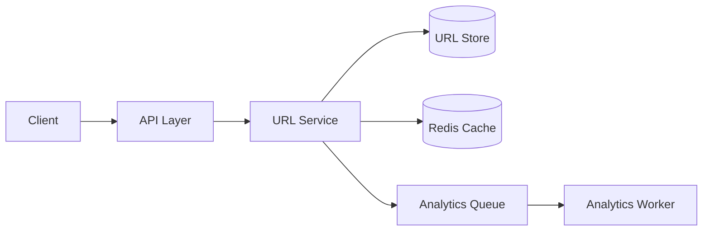
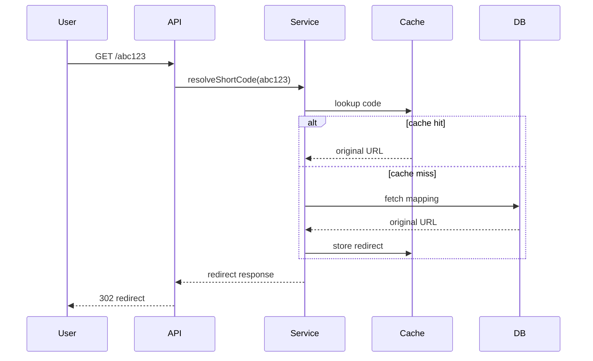
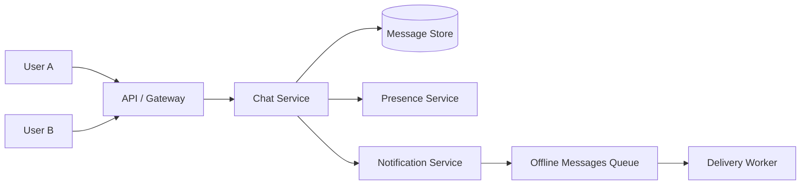
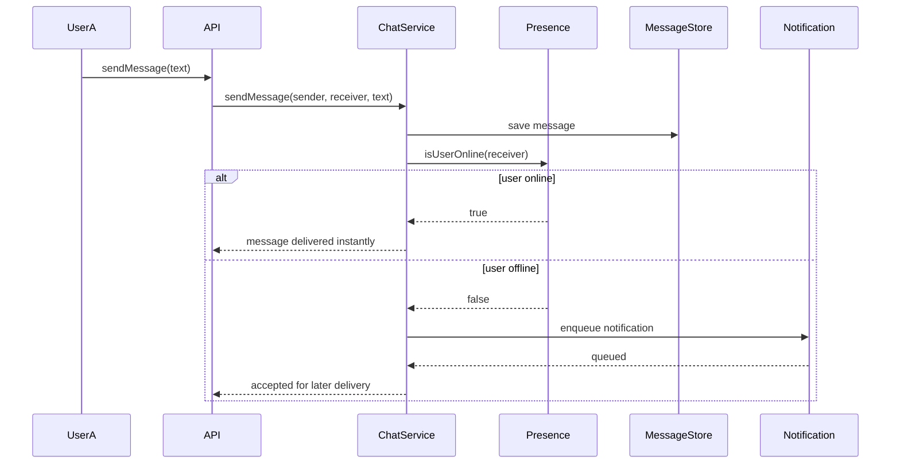
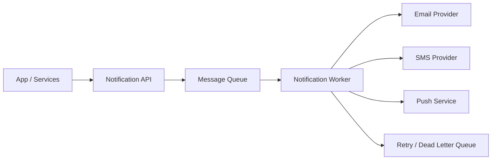
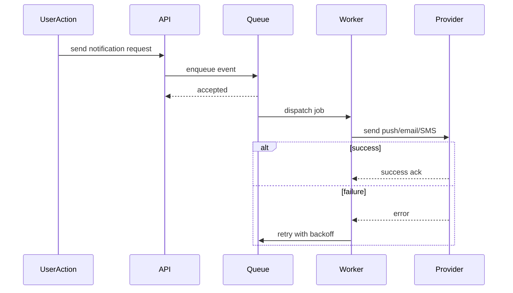

# System Design Diagrams and Notes

This file contains diagram-style notes you can use while preparing for interviews.

## 1. URL Shortener component diagram

### Explanation
- The API layer receives create and redirect requests.
- The URL service generates short codes and resolves them.
- Redis handles hot redirects.
- A separate analytics worker avoids slowing down the redirect path.

## 2. URL Shortener sequence diagram

## 3. Chat system component diagram

### Explanation
- The chat service stores messages and checks presence.
- If the receiver is online, delivery is immediate.
- If offline, a notification is queued for later processing.

## 4. Chat system sequence diagram

## 5. Notification pipeline component diagram

### Explanation
- Requests are accepted quickly and placed in a queue.
- Workers handle provider calls asynchronously.
- Retry logic and dead-letter processing improve reliability.

## 6. Notification pipeline sequence diagram

## 7. What to explain in interviews using diagrams

When you present a design diagram, explain:
- the entry points
- the major components and responsibilities
- the critical data flow
- the failure points and retry strategy
- the scaling plan and bottlenecks

## 8. Interview tip

A diagram is not enough by itself. You should also say:
- where the system is read-heavy or write-heavy
- which piece is the bottleneck
- where you would add caching or asynchronous workers
- which tradeoff is being chosen and why
